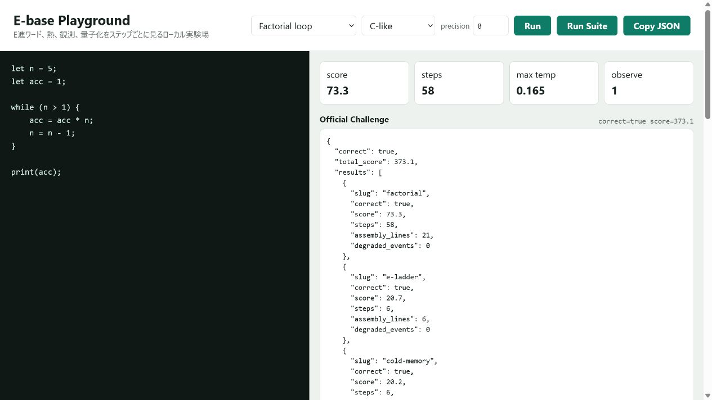

# E-base Computer Emulator

`e-base-computer` は、E進ワード、熱、量子化、観測、リフレッシュを扱う
実験的なエミュレーター、C風コンパイラ、ローカルWeb Playgroundです。

目的は、決定的に再現できるE進計算モデルを公開し、他の人がコンパイラ最適化
や可視化で参加できる土台を作ることです。



## 30秒で動かす

前提: Python 3.11以上を用意し、GitHubからcloneしたcheckoutのルートで実行します。

```powershell
git clone https://github.com/AAAmirinu/e-base-computer.git
cd e-base-computer
python -m pip install -e .
ebase demo --run
ebase run .\examples\challenges\factorial.cbase --json
ebase-playground
```

[Try the Playground](https://aaamirinu.github.io/e-base-computer/) では、インストールなしで
静的版のサンプルと E 進の状態表示を試せます。
GitHub Pages版はデモ用の静的Playgroundです。公式チャレンジ提出用JSONは、CLIまたはローカルの
`ebase-playground` Pythonサーバ版で取り直してください。

Playgroundを起動したら、ブラウザで `http://127.0.0.1:8765` を開きます。
`ebase` が PATH に入らない環境では、同じ操作を `python -m epu_cli ...` で実行できます。

DockerでPlaygroundだけ試す場合:

```powershell
docker build -t e-base-computer .
docker run --rm -p 8765:8765 e-base-computer
```

GitHub Codespacesでは、コンテナ作成後に次を実行すると転送されたポートで開けます。

```powershell
ebase-playground --host 0.0.0.0
```

GitHub Pagesでは `web/playground/` を静的Playgroundとして公開できます。静的版はブラウザ内蔵の
`static fallback` ランタイムでサンプルを動かせます。公式コンテスト採点や完全なエミュレーター挙動は、
CLIまたは `ebase-playground` のPythonサーバ版で確認してください。

インストールせずに動かす場合:

```powershell
python .\examples\demo.py
python .\examples\epu_demo.py
python .\examples\cstyle_demo.py
python -m unittest discover -s tests
```

## 遊び方の入口

- Playgroundでサンプルを選んで `Run` し、E桁、温度、観測イベントを眺める。
- `Copy Program Link` で編集中のC-like/EPUコードをURLとして共有する。
- ローカル版の `Run Official Suite` で公式チャレンジを実行し、`Copy JSON` で結果を共有する。
- `examples/challenges/` のプログラムを変えて、より短い/冷たいEPUアセンブリを試す。
- コンパイラや可視化を改造して、IssueやDiscussionで結果を見せる。

## 基本アイデア

E進ワードは、ネイピア数 `e` のべき乗の係数列として値を保持します。

```text
value = sum digit[k] * e^k
```

各桁は `0 <= digit < e` の値を持つ連続桁です。この資料では、この桁を
**edit** または **E桁** と呼びます。

このエミュレーターでは、次の要素を扱えます。

- `[0, e)` の連続桁
- 有限長のE進ワード
- Eキャリーによる正規化
- 加算、減算、乗算、`e` のべき乗によるシフト
- `ER0..ER15` のEレジスタ
- `EP0..EP7` のEポインタとEメモリ
- 温度、ガードバンド、安全分割数
- 量子化、劣化、観測、リフレッシュ
- 命令ごとの `timeline()` とWeb可視化

## Eならではの挙動

このモデルでは、算術やメモリ操作によって対象の温度が上がり、各tickで少しずつ冷えます。
温度が上がると状態を安全に区別するためのguardが広がり、利用できる量子化分割数が
`243 -> 81 -> 27 -> 9 -> 3` と段階的に下がります。要求精度を維持できない場合は、
設定に応じて `DEGRADED` とともに低い分割へ降格するか、`THERMAL_PRECISION_ERROR` で
停止します。

観測には外部出力と熱のコストがあり、リフレッシュは温度と推定noiseを下げます。ただし
リフレッシュ後も高い分割へ自動復帰はしないため、プログラム側で再量子化が必要です。
`WORK`, `COLD`, `ARCHIVE`, `SACRED` は最低温度、guard、冷却速度が異なり、
どのバンクへ置くかもプログラムの挙動とスコアへ影響します。

数式、命令ごとの熱コスト、バンク差、量子化例、スコアとの関係は
[E-base Computer Behavior Model](docs/behavior_model.md) にまとめています。

## CLI

```powershell
ebase compile .\examples\challenges\factorial.cbase
ebase run .\examples\challenges\factorial.cbase
ebase run .\examples\challenges\thermal_quantization.epu --language asm --json
ebase samples
ebase samples thermal-degrade --run --json
ebase challenge
ebase challenge --json
ebase challenge thermal-degrade --json
ebase challenge --assembly-dir .\generated-assembly --json
ebase leaderboard .\examples\challenges\baseline_submission.json
ebase spec --json
```

PATHにスクリプトディレクトリが入っていない場合:

```powershell
python -m epu_cli run .\examples\challenges\factorial.cbase --json
python -m web_playground
```

CLIは実行結果に加えて、ステップ数、最大温度、観測回数、劣化回数をまとめた
チャレンジ用スコアも出力します。

## C風簡易言語

```c
let n = 5;
let acc = 1;

while (n > 1) {
    acc = acc * n;
    n = n - 1;
}

print(acc);
```

対応範囲:

- `let`, `float`, `double`, `e` による変数宣言
- 代入
- `print(expr);` / `observe(expr);`
- `if/else`
- `while`
- 数値、変数、括弧、単項マイナス
- `+`, `-`, `*`
- `>`, `<`, `>=`, `<=`, `==`, `!=`

詳細は [docs/cstyle_compiler.md](docs/cstyle_compiler.md) を参照してください。
EPU命令セットは [docs/epu_instruction_set.md](docs/epu_instruction_set.md) と
`ebase spec --json` で確認できます。

## Web Playground

```powershell
ebase-playground
```

Playgroundでは、左側にC風ソースまたはEPUアセンブリを書き、右側で次を確認できます。

- 生成されたEPUアセンブリ
- 観測出力
- ステップ数、スコア、最大温度、観測回数
- 命令イベント一覧
- 温度タイムライン
- 公式チャレンジ結果と提出用JSON

ローカル開発用サーバなので、公開インターネットへ直接さらさないでください。公開ページとして見せる場合は
GitHub Pages workflowで配る静的Playgroundを使えます。静的版は画面上に `static fallback` と表示され、
Pythonサーバなしでサンプル実行とチャレンジJSONの雰囲気を試せます。

## コンパイラチャレンジ

公式チャレンジは `ebase challenge` で実行します。現在の公式スイートは、
CLIとPlaygroundで共有している組み込みサンプル5件です。

- `factorial`
- `e-ladder`
- `cold-memory`
- `thermal-degrade`
- `branching`

`examples/challenges/` には、単体実行や説明用の課題ファイルも置いています。

評価軸は速さだけではありません。E進コンピュータらしく、次のような値を見ます。

- 命令ステップ数
- 最大温度
- 観測回数
- `DEGRADED` 発生回数
- 確保したEメモリセル数
- リフレッシュ回数

詳細は [docs/compiler_challenge.md](docs/compiler_challenge.md) を参照してください。
提出はGitHubの `Issues` -> `New issue` -> `Compiler challenge entry` から作ります。
テンプレート本文は [.github/ISSUE_TEMPLATE/compiler_challenge.md](.github/ISSUE_TEMPLATE/compiler_challenge.md) です。
Issue本文には `ebase challenge --json` またはローカル版Playgroundの `Copy JSON` 結果を貼る形を基本にします。
静的GitHub Pages版の結果はデモ用なので、公式提出にはCLIまたはPythonサーバ版PlaygroundのJSONを使います。
Discussionは交流・解説・途中経過の共有場所として使えます。

公式ベースラインは次で再現できます。

```powershell
ebase challenge --json
ebase leaderboard .\examples\challenges\baseline_submission.json
```

外部コンパイラが生成したアセンブリを採点する場合は、`factorial.epu` など公式slug名の
`.epu` をディレクトリに置き、次を実行します。存在しないslugは内蔵baselineにfallbackします。
まず動く提出枠を作りたい場合は、公式baselineアセンブリをスターターとして出力できます。

```powershell
python .\examples\compiler_starter\emit_baseline_assembly.py --output .\generated-assembly
ebase challenge --assembly-dir .\generated-assembly --json
```

提出前には、このJSONの `correct` が `true` であることを確認してください。

## テスト

```powershell
python -m unittest discover -s tests
```

GitHub Actionsでも同じテストとデモを実行します。

## ファイル構成

- `src/ecomputer.py` - E進ワード演算と小さな仮想マシン
- `src/epu.py` - EPUエミュレーターのプロトタイプ
- `src/emulator.py` - ラベル、分岐、停止、実行制限を持つ上位エミュレーター
- `src/cstyle_compiler.py` - C風簡易言語からEPUアセンブリへのコンパイラ
- `src/epu_cli.py` - CLI
- `src/epu_scoring.py` - チャレンジ用スコアリング
- `src/web_playground.py` - ローカルWeb Playgroundサーバ
- `web/playground/` - Playground UI
- `examples/` - デモとチャレンジ課題
- `examples/compiler_starter/` - 外部コンパイラ参加用のbaseline `.epu` 生成スターター
- `tests/` - 回帰テスト
- `docs/` - 技術仕様、利用方法、チャレンジ説明

貢献の入口は [CONTRIBUTING.md](CONTRIBUTING.md) と `.github/ISSUE_TEMPLATE/` を参照してください。
変更履歴は [CHANGELOG.md](CHANGELOG.md) にあります。

## License and Scope

コードと技術ドキュメントは [Apache-2.0](LICENSE) です。派生配布では
[NOTICE](NOTICE) の帰属表示を保持してください。プロジェクト名とロゴの扱いは
[TRADEMARKS.md](TRADEMARKS.md)、公開範囲は [TECHNICAL_SCOPE.md](TECHNICAL_SCOPE.md)
を参照してください。E進ワードの最小技術モデルは [docs/e_word_model.md](docs/e_word_model.md) にあります。
